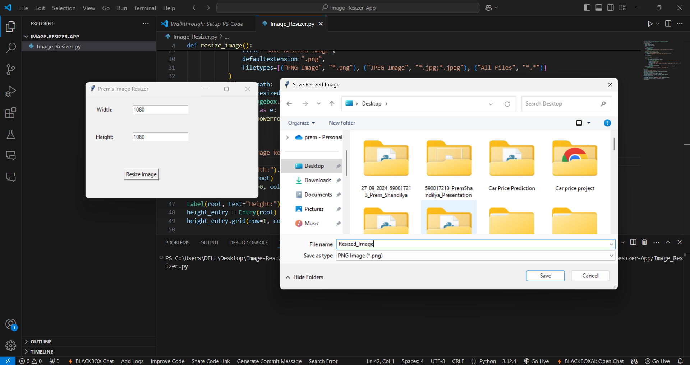

# Image-Resizer-App
A simple Python app that resizes images using a Tkinter-based GUI. Users can specify custom dimensions, select an image, and save the resized version. The app also supports preserving the aspect ratio when resizing, ensuring images maintain their proportions.

## Features

- Resize images to custom dimensions (width and height).
- Supports common image formats like PNG, JPEG, BMP, GIF, and TIFF.
- Option to preserve the aspect ratio by calculating one dimension based on the other.
- Easy-to-use GUI built with Tkinter.

## Requirements

To run this project, you will need Python 3 and the following libraries:

- Tkinter (usually comes pre-installed with Python)
- Pillow (for image processing)

You can install Pillow by running:

```bash
pip install Pillow
```

## Setup and Usage

1. **Clone the repository:**
   First, clone the repository to your local machine using Git.

   ```bash
   git clone https://github.com/soypremshandilya/Image-Resizer-App.git
   ```


3. **Run the application:**
   Run the `Image_Resizer.py` script.

   ```bash
   python image_resizer.py
   ```

   This will open the Image Resizer app with a GUI where you can input the desired width and height, select an image, and save the resized version.

## How to Use

1. **Enter Width and Height:**
   - In the application window, you will see two input fields labeled "Width" and "Height."
   - Enter the desired dimensions in pixels for your image.
   
2. **Select an Image:**
   - Click on the "Resize Image" button.
   - A file dialog will open, allowing you to select an image from your computer.

3. **Save Resized Image:**
   - After selecting the image, you will be prompted to choose where to save the resized image.
   - Choose a location and save the resized image.

4. **Aspect Ratio (Optional):**
   - If you only input one of the dimensions (either width or height), the app will automatically calculate the missing dimension based on the aspect ratio of the original image.

## Example Use Case

- **Resizing to a specific size:** You can resize images to any dimensions you specify, whether it’s for web use, social media posts, or any other purpose.
  
- **Resizing without losing aspect ratio:** If you want to resize an image without distorting it, just input one dimension and the app will automatically calculate the other one to keep the aspect ratio intact.
---

## Screenshots


Example:
- **Set Height and Width**  

**Choose Image**

**Save Image**


---


## Acknowledgments

- This project uses the [Pillow](https://pillow.readthedocs.io/en/stable/) library for image processing.
- Tkinter is used for building the GUI.


---

## Author
Developed by [soypremshandilya](https://github.com/soypremshandilya).

---

## Contribution
Contributions are welcome! Feel free to fork this repository and create a pull request for any improvements or bug fixes.
